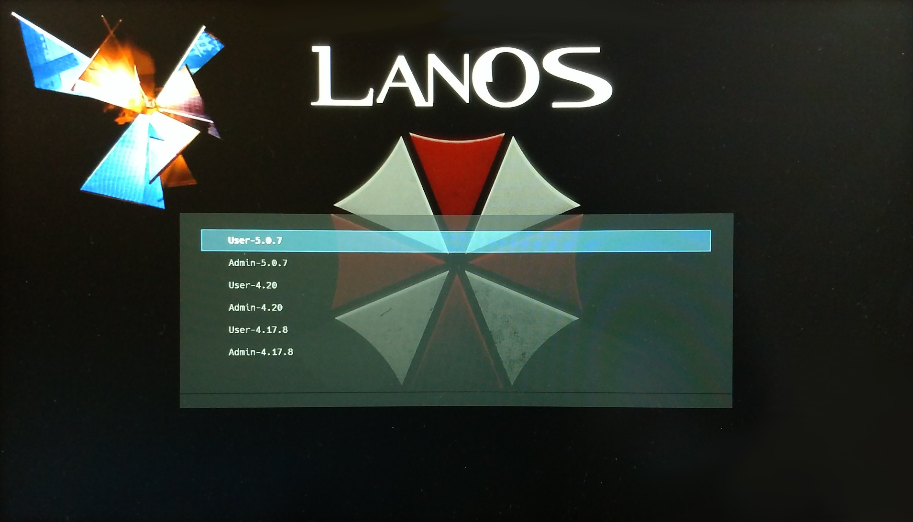

LAPAS
====

**La**n**Pa**rty**S**erver, or LAPAS for short, is a Linux distribution configuration that simplifies the setup required to get a LAN-Party up and running.

Its architecture employs a central server that hosts a network-bootable guest operating system containing all of the software (games) required for the LAN-party. Biologicial guests connect their PCs to the internal network that LAPAS creates, activate network boot, and boot into the distribution. Then, they log in with their own user and are ready to go.

### Manual
The manual of how to build this can be found in the [MANUAL.md](./MANUAL.md). This was created using HackMD/CodiMD/HedgeDoc.
It is not entirely compatible with GitHub's Markdown implemetation. A complete rendered version of the manual can be found [here](https://demo.hedgedoc.org/s/_cyJJ2aHN#).