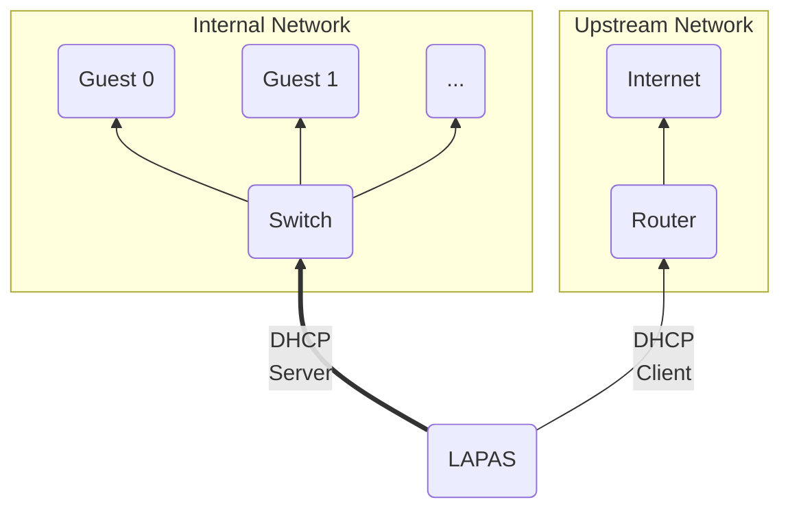
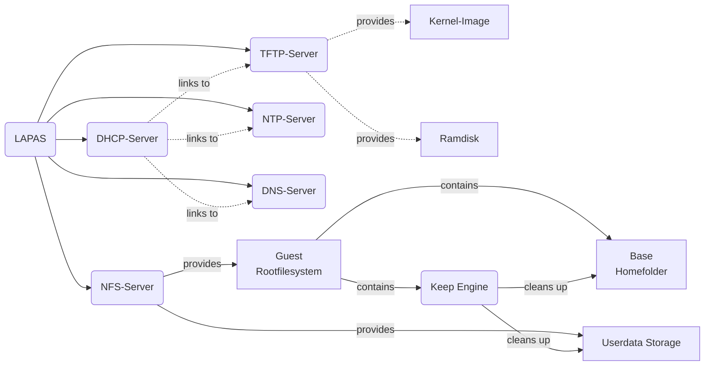
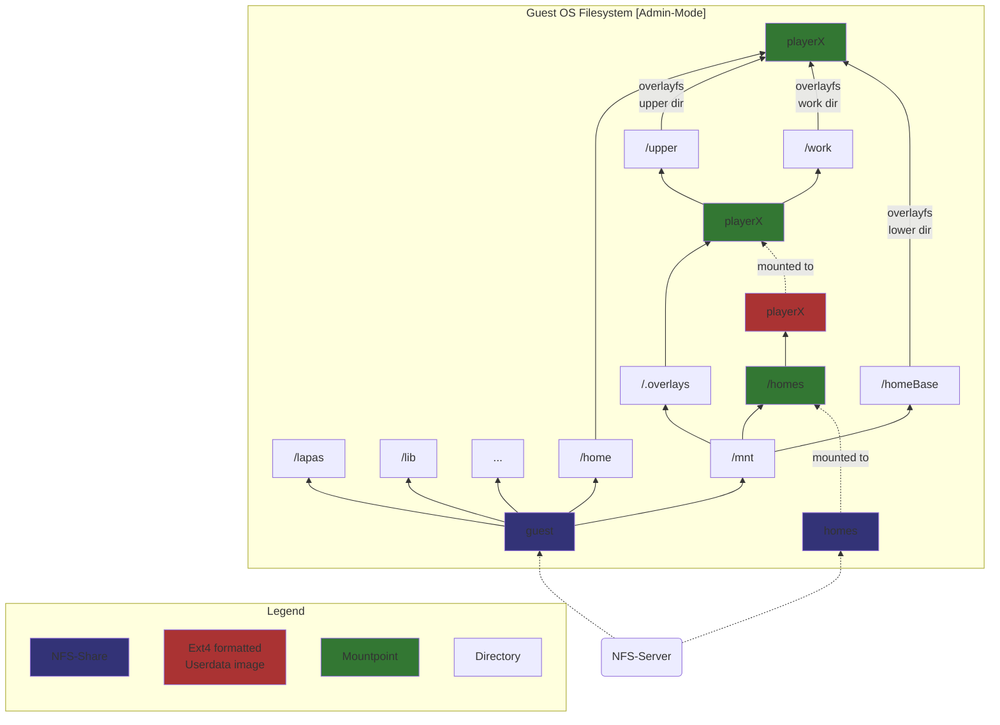
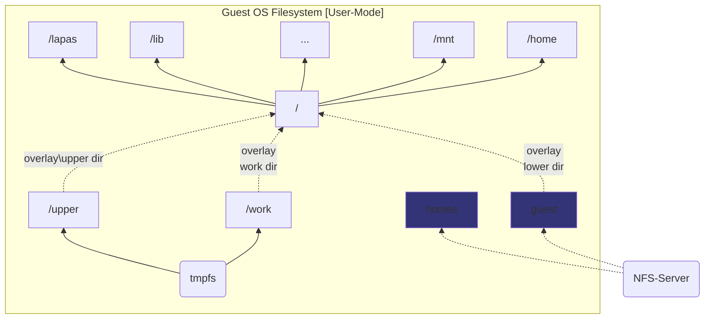

LAPAS
====

**La**n**Pa**rty**S**erver, or LAPAS for short, is a Linux distribution configuration that simplifies the setup required to get a LAN-Party up and running.

Its architecture employs a central server that hosts a network-bootable guest operating system containing all of the software (games) required for the LAN-party. Biologicial guests connect their PCs to the internal network that LAPAS creates, activate network boot, and boot into the distribution. Then, they log in with their own user and are ready to go.

Each users settings and game states are stored in their own persistent home storage.

### Architecture
Here is a small overview of LAPAS' architecture
#### Network Architecture
The following graph shows the network architecture of LAPAS.
The internal network (connection between LAPAS and switch that connects all guests) can easily be done via an arbitrary amount of NICs in a bond setup, in order to achieve higher total bandwidths.
Since the entire guest operating system, as well as all of the game data is stored on the server, this can reduce game loading times if multiple players are connected.

#### Services Architecture
This graph gives a light overview of all the services that make up the LAPAS functionality, as well as their connections.

#### Guest OS Architecture
The Guest OS's filesystem architecture differs between User-Mode and Admin-Mode.
The following graph shows the whole filesystem architecture in Admin-Mode:

In User-Mode, the guests' root filesystem from the server is mounted readonly, so normal users can't make any permanent changes to the guest OS.
If 10 players would be logged into the same system with write access to the same network share, hell would break loose.
Though since getting a system with a pure read-only root filesystem going is hard, a tmpfs is layered on top of the guest rootfilesystem mounted from the server.
So every player can make local changes to the entire system that are stored in the RAM of their machines.
The general architecture of the guest filesystem between Admin and User-Mode is the same, the only thing that's different is how the root filesystem is handled.
This graph shows how User-Mode differs from Admin-Mode, with the identical parts left out:

### Requirements
- Your server needs at least 2 network cards.
	- One NIC is upstream into a network with internet (required for updates and initial installation, not necessarily required during offline lanpartys)
	- The remaining NICs form an internal network to which all the clients are connected. The script supports multiple nics by creating a bond, so you can select as many nics as you want for more bandwidth.
- Clients that support network booting / PXE booting

### Installation
This repository contains the source code for an half-interactive installer script that sets up a minimal LAPAS installation based on top of a cleanly installed Debian 11.
I suggest installing LAPAS baremetal on a host that's meant for just this purpose.
To do that, follow this process:

#### Step by Step:
- Install clean Debian 11
- Prepare the installation folder (e.g. `/mnt/lapas`)
	- Should have high I/O throughput and a large capacity. That's where all the data will be stored.
- Download the latest `lapas_installer.sh` from the GitHub Releases page onto the host
- Execute the script
