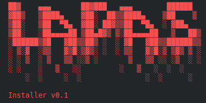
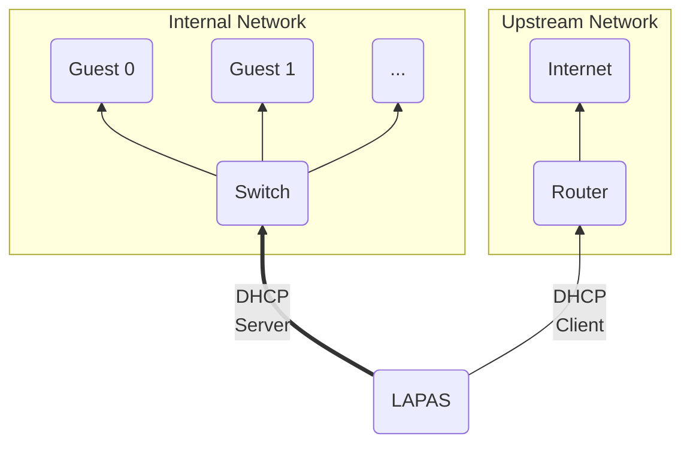
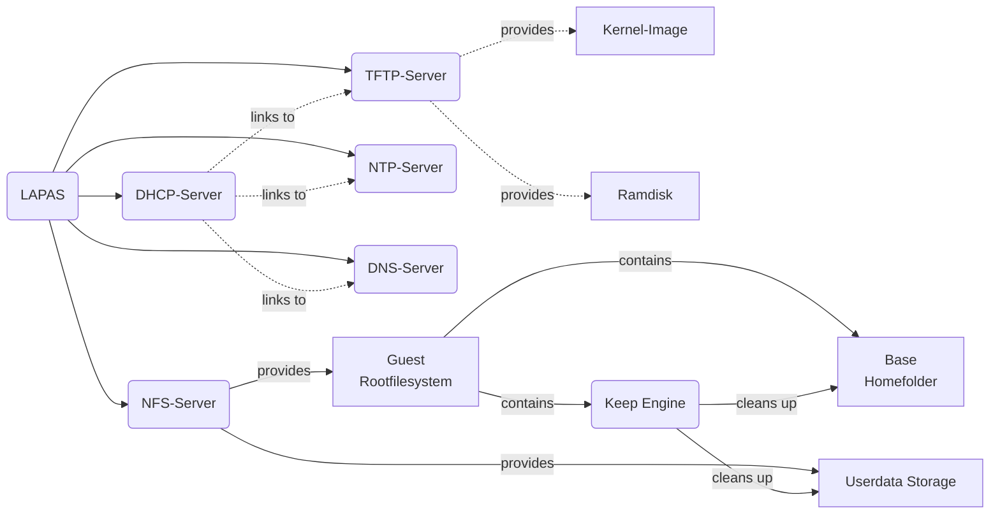
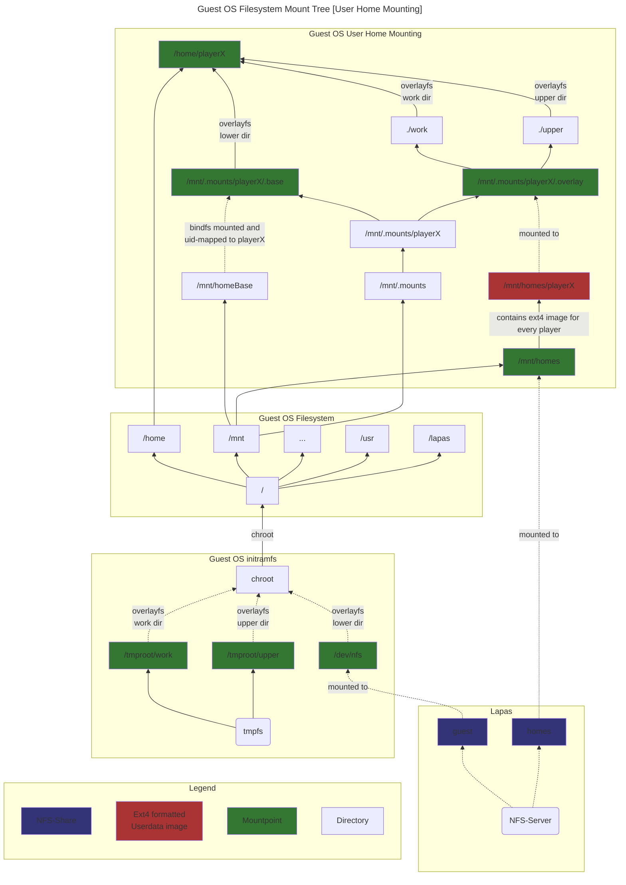

LAPAS
====

**La**n**Pa**rty**S**erver, or LAPAS for short, is a Linux distribution configuration that simplifies the setup required to get a LAN-Party up and running.

Its architecture employs a central server that hosts a network-bootable guest operating system containing all of the software (games) required for the LAN-party. Biologicial guests connect their PCs to the internal network that LAPAS creates, activate network boot, and boot into the distribution. Then, they log in with their own user and are ready to go.

Each users settings and game states are stored in their own persistent home storage.

### Architecture
Here is a small overview of LAPAS' architecture
#### Network Architecture
The following graph shows the network architecture of LAPAS.
The internal network (connection between LAPAS and switch that connects all guests) can easily be done via an arbitrary amount of NICs in a bond setup, in order to achieve higher total bandwidths.
Since the entire guest operating system, as well as all of the game data is stored on the server, this can reduce game loading times if multiple players are connected.

#### Services Architecture
This graph gives a light overview of all the services that make up the LAPAS functionality, as well as their connections.

#### Guest OS Architecture
The guest operating system can be booted into two major modes. Admin-Mode, and User-Mode.

**Admin-Mode** is used to make permanent changes to the guest operating system. In this mode, the guest's root filesystem
is mounted read/write and only the default-user (`lapas`), as well as system users (`root` etc.) are permited to login.

**User-Mode** is meant for "production"-use. This is the boot option that players login with. In this mode, no permanent
changes can be made to the system. This is handled by mounting the guest root filesystem read-only, and overlaying it with a
tmpfs, such that changes can be made - but only in each guest's RAM. In this mode, normal player users may login. Since players
need permanent storage, for stuff like their game progress or video configuration, they are handled specially. Each player gets
a sparce file, formatted with ext4 that will contain their player-specific files, layered on top of the default-user's (`lapas`)
home directory. To handle permissions properly (wine is very bitchy here), the default-user's home directory is lazily [bindfs](https://bindfs.org/)-mounted
for every player to login on a machine. Like this, all files within the player's home directory will seem to belong to him, even
when they actually come from the default-user's home directory. Like this, the default-user can setup wineprefixes that can then
simply be used by every player. Here is a graph of the whole filesystem architecture in User-Mode when a normal player `playerX` logs in:

### Requirements
- Your server needs at least 2 network cards.
	- One NIC is upstream into a network with internet (required for updates and initial installation, not necessarily required during offline lanpartys)
	- The remaining NICs form an internal network to which all the clients are connected. The script supports multiple nics by creating a bond, so you can select as many nics as you want for more bandwidth.
- Clients that support network booting / PXE booting

### Installation
This repository contains the source code for an half-interactive installer script that sets up a minimal LAPAS installation based on top of a cleanly installed Debian 13.
I suggest installing LAPAS baremetal on a host that's meant for just this purpose.
To do that, follow this process:

#### Step by Step:
- Install clean Debian 13
- Prepare the installation folder (e.g. `/mnt/lapas`)
	- Should have high I/O throughput and a large capacity. That's where all the data will be stored.
- Download the latest `lapas_installer.sh` from the GitHub Releases page onto the host
- Execute the script
